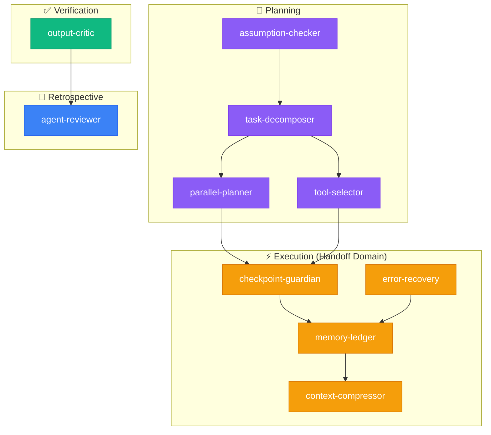

<div align="center">

# 🛠️ fth-skills

**Curated AI agent skills for coding workflows, decision-making, and agentic task safety**

[](LICENSE)
[](#-available-skills)
[](https://skills.sh/)

*Reusable instruction packs for the [skills.sh](https://skills.sh/) ecosystem — works with Claude Code, Cursor, Copilot, Gemini CLI, and more.*

</div>

---

## ⚡ Quick Install

```bash
# Install all skills
npx skills add fatih-developer/fth-skills

# Install a single skill
npx skills add fatih-developer/fth-skills --skill <skill-name>
```

---

## 🎯 Available Skills (15 Curated + 30 Coming Soon)

The repository is structured into a **Layered Monorepo Architecture**. Skills are organized into Domain-Specific capabilities and Core Agentic Orchestration.

### 💼 Domain Ecosystems (Coming Soon)

Domain skills work together natively using the **Hybrid Handoff Pattern**. Each domain has an `ECOSYSTEM.md` map that orchestrators read to understand the exact sequence of skills required for a workflow (e.g., Pre-Launch Audit, Database Migration).

#### 📱 Mobile App Domain (`domains/mobile`) - *[COMING SOON]*
| Skill | Install | Description |
|-------|---------|-------------|
| **accessibility-enforcer** | `--skill accessibility-enforcer` | Audits UI for VoiceOver/TalkBack & WCAG contrast compliance. |
| **mobile-perf-auditor** | `--skill mobile-perf-auditor` | Evaluates bundle size, memory leaks, battery drain, and frame drops. |
| **mobile-security-auditor** | `--skill mobile-security-auditor` | Discovers insecure local storage, exposed API keys, and reverse-engineering risks. |
| **release-orchestrator** | `--skill release-orchestrator` | Manages semantic versioning, staged rollouts, and changelog generation. |
| **crash-analyst** | `--skill crash-analyst` | Analyzes stack traces and symbolication to pinpoint crash root causes. |
| *(+5 more)* | | `deep-link-architect`, `offline-sync-designer`, `onboarding-designer`, `push-notification-planner`, `app-store-reviewer` |

#### 🌐 API Domain (`domains/api`) - *[COMING SOON]*
| Skill | Install | Description |
|-------|---------|-------------|
| **contract-first-designer** | `--skill contract-first-designer` | Designs OpenAPI/AsyncAPI specifications before writing any code. |
| **api-mock-designer** | `--skill api-mock-designer` | Scaffolds mock servers and JSON response payloads based on the contract. |
| **protocol-selector** | `--skill protocol-selector` | Evaluates REST vs GraphQL vs gRPC based on usage requirements. |
| **breaking-change-detector** | `--skill breaking-change-detector` | Flags backward-incompatible payload or endpoint changes. |
| *(+6 more)* | | `auth-flow-designer`, `rate-limit-strategist`, `sdk-scaffolder`, `changelog-generator`, `webhook-architect`, `api-observability-planner` |

#### 🗄️ Database Domain (`domains/database`) - *[COMING SOON]*
| Skill | Install | Description |
|-------|---------|-------------|
| **schema-architect** | `--skill schema-architect` | Normalizes DB schema (BCNF/3NF), generates DDL, prevents God Tables. |
| **index-advisor** | `--skill index-advisor` | Recommends covering and composite indexes for slow queries. |
| **migration-strategist** | `--skill migration-strategist` | Designs zero-downtime up/down migration scripts and backfill jobs. |
| **access-policy-designer** | `--skill access-policy-designer` | Designs Row-Level Security (RLS) constraints and access roles. |
| *(+6 more)* | | `query-explainer`, `query-budget-enforcer`, `schema-diff-analyzer`, `data-masker`, `data-lineage-tracer`, `seed-data-generator` |

#### ⚛️ Frameworks (`domains/react-flow`)
| Skill | Install | Description |
|-------|---------|-------------|
| **react-flow** | `--skill react-flow` | Audit, repair, migrate, and scaffold `@xyflow/react` projects. |

---

### 🧠 Core Agentic Ecosystem (9 skills)

These foundational skills provide decision-making, safety, and orchestration. They sit in the `core/`, `planning/`, and `execution/` layers.

| Skill | Layer | Install | Description |
|-------|-------|---------|-------------|
| **task-decomposer** | Planning | `--skill task-decomposer` | Break complex tasks into subtasks with dependency maps. Consults `ECOSYSTEM.md` guides automatically. |
| **parallel-planner** | Planning | `--skill parallel-planner` | Identify parallelizable steps, build dependency graphs, detect conflicts. |
| **tool-selector** | Planning | `--skill tool-selector` | Select optimal tools, plan call sequence, prevent unnecessary tool invocations. |
| **checkpoint-guardian** | Execution | `--skill checkpoint-guardian` | Risk assessment before critical actions. Requires user confirmation for high-risk operations. |
| **memory-ledger** | Execution | `--skill memory-ledger` | Structured task memory — tracks decisions, bugs, status throughout multi-step tasks. |
| **error-recovery** | Execution | `--skill error-recovery` | Classify errors (transient/config/logic/permanent) and apply recovery strategies. |
| **context-compressor** | Execution | `--skill context-compressor` | Compress context by 70% while preserving decisions, errors, and critical data. |
| **output-critic** | Core | `--skill output-critic` | Score output quality by type-specific criteria, accept/reject gate. |
| **assumption-checker** | Core | `--skill assumption-checker` | Surface and verify agent assumptions before acting. |
| **agent-reviewer** | Core | `--skill agent-reviewer` | Post-task retrospective across 6 dimensions. |

### Experimental (Preview)

| Skill | Install | Description |
|-------|---------|-------------|
| **multi-brain-experts** | `--skill multi-brain-experts` | Domain-specific expert perspectives. Auto-selects 3 experts from a pool of 16 (Security, Performance, UX, Cost...). |
| **multi-brain-debate** | `--skill multi-brain-debate` | Two-round adversarial debate: positions → challenges & rebuttals → verdict. |
| **multi-brain-score** | `--skill multi-brain-score` | Confidence scoring (1-10) per perspective with weighted consensus and uncertainty flags. |

> **Experimental skills** are fully functional but may evolve. They graduate to curated once stable.

---

## 🧩 Ecosystem Architecture & Handoffs

The `fth-skills` repository uses a **Hybrid Handoff Pattern** allowing individual skills to act as a cohesive team.

1. **Domain Ecosystem Guides:** `domains/*/ECOSYSTEM.md` files dictate standard workflows (e.g., *The Pre-Release Audit Flow*).
2. **Planner Awareness:** Central orchestrator agents (like `task-decomposer`) automatically ingest these guides when planning domain-specific tasks.
3. **Skill-to-Skill Handoffs:** Individual skills (`SKILL.md`) specify `🔗 Next Steps` logic. For example: `schema-architect` automatically hands execution context to `access-policy-designer` when it finishes generating DDL.

### Core Lifecycle Graph


*Existing environments utilizing the flat structure (e.g., `npx skills add --skill tool-selector`) are completely supported via **100% backward-compatible root symlinks** within `.curated/`.*

---

## 📁 Repository Structure

```
fth-skills/
├── skills/
│   ├── .curated/           # Layered Monorepo Architecture
│   │   │                     # (Symlinks reside here for backward compatibility)
│   │   ├── core/           # Foundational agents (multi-brain, etc)
│   │   ├── execution/      # Runtime safety (checkpoint-guardian...)
│   │   ├── planning/       # Orchestrators (task-decomposer...)
│   │   ├── domains/        
│   │   │   ├── api/        # 10 skills + ECOSYSTEM.md
│   │   │   ├── database/   # 10 skills + ECOSYSTEM.md
│   │   │   ├── mobile/     # 10 skills + ECOSYSTEM.md
│   │   │   └── react-flow/ # UI Framework skills
│   └── .experimental/      # Preview, may evolve
│       ├── multi-brain-experts/
│       ├── multi-brain-debate/
│       └── multi-brain-score/
├── scripts/
│   └── validate_curated_skills.py
├── README.md
└── LICENSE
```

Each skill folder contains:
- `SKILL.md` — Main instruction file (required)
- `references/` — Supporting docs, checklists, examples
- `templates/` — Reusable output templates
- `agents/` — Agent platform manifests (OpenAI, etc.)

---

## 🤝 Contributing

1. Create a folder under `skills/.curated/<domain>/<name>/` or `skills/.experimental/<name>/`
2. Add `SKILL.md` with frontmatter:
   ```yaml
   ---
   name: skill-name
   description: What it does and when it should trigger.
   ---
   ```
3. Add supporting folders as needed: `references/`, `templates/`, `agents/`
4. Run validation:
   ```bash
   python scripts/validate_curated_skills.py
   python scripts/validate_curated_skills.py --root skills/.experimental
   ```
5. Update this README and submit a PR

---

## License

MIT
