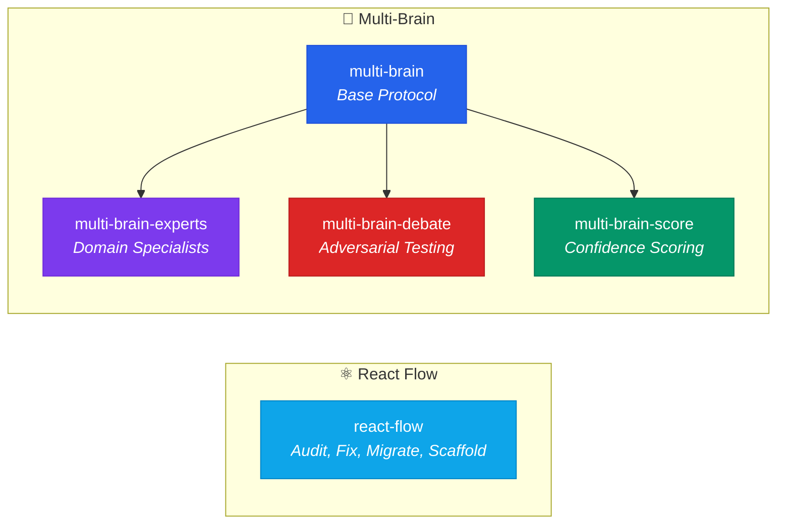

<div align="center">

# 🛠️ fth-skills

**Curated AI agent skills for coding workflows and decision-making**

[](LICENSE)
[](#-available-skills)
[](https://skills.sh/)

*Reusable instruction packs for the [skills.sh](https://skills.sh/) ecosystem — works with Claude Code, Cursor, Copilot, Gemini CLI, and more.*

</div>

---

## ⚡ Quick Install

```bash
# Install all skills
npx skills add fatih-developer/fth-skills

# Install a single skill
npx skills add fatih-developer/fth-skills --skill <skill-name>
```

---

## 🎯 Available Skills

### Curated (Stable)

| Skill | Install | Description |
|-------|---------|-------------|
| **react-flow** | `--skill react-flow` | Audit, repair, migrate, and scaffold `@xyflow/react` projects with typed patterns and safe auto-fix workflow. Includes migration support. |
| **multi-brain** | `--skill multi-brain` | Evaluate requests from 3 independent perspectives (Creative, Pragmatic, Comprehensive), reach consensus, then produce complete output. |

### Experimental (Preview)

| Skill | Install | Description |
|-------|---------|-------------|
| **multi-brain-experts** | `--skill multi-brain-experts` | Replaces fixed perspectives with domain-specific experts (Security, Performance, UX, Cost...) auto-selected per request. |
| **multi-brain-debate** | `--skill multi-brain-debate` | Two-round adversarial debate: positions → challenges & rebuttals → verdict. For high-stakes decisions. |
| **multi-brain-score** | `--skill multi-brain-score` | Confidence scoring (1-10) per perspective with weighted consensus and uncertainty flags. |

> **Experimental skills** are fully functional but may evolve. They graduate to curated once stable.

---

## 🧩 Skill Families

Skills are organized into families — related skills that share a common foundation.



---

## 📁 Repository Structure

```
fth-skills/
├── skills/
│   ├── .curated/           # Stable, production-ready
│   │   ├── multi-brain/
│   │   └── react-flow/
│   └── .experimental/      # Preview, may evolve
│       ├── multi-brain-experts/
│       ├── multi-brain-debate/
│       └── multi-brain-score/
├── scripts/
│   └── validate_curated_skills.py
├── README.md
└── LICENSE
```

Each skill folder contains:
- `SKILL.md` — Main instruction file (required)
- `references/` — Supporting docs, checklists, examples
- `templates/` — Reusable output templates
- `agents/` — Agent platform manifests (OpenAI, etc.)

---

## 🤝 Contributing

1. Create a folder under `skills/.curated/<name>/` or `skills/.experimental/<name>/`
2. Add `SKILL.md` with frontmatter:
   ```yaml
   ---
   name: skill-name
   description: What it does and when it should trigger.
   ---
   ```
3. Add supporting folders as needed: `references/`, `templates/`, `agents/`
4. Run validation:
   ```bash
   python scripts/validate_curated_skills.py
   python scripts/validate_curated_skills.py --root skills/.experimental
   ```
5. Update this README and submit a PR

---

## License

MIT
