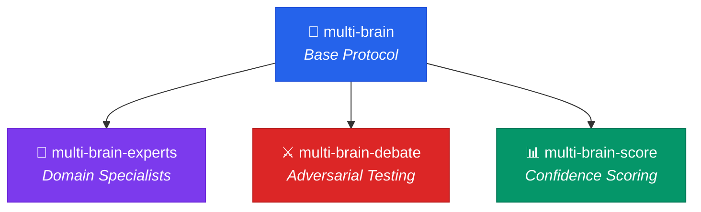

<div align="center">

# 🧠 fth-skills

**AI agent skills for smarter decision-making and coding workflows**

[](LICENSE)
[](#available-skills)
[](https://skills.sh/)

*Curated instruction packs for the [skills.sh](https://skills.sh/) ecosystem — works with Claude Code, Cursor, Copilot, Gemini CLI, and more.*

</div>

---

## ⚡ Quick Install

```bash
# Install all skills
npx skills add fatih-developer/fth-skills

# Install a single skill
npx skills add fatih-developer/fth-skills --skill multi-brain
```

---

## 🎯 What's Inside

This repository contains two skill families:

### 🧠 Multi-Brain Family — *Think before you act*

A decision-making framework that evaluates requests from multiple independent perspectives before producing output.



### ⚛️ React Flow — *Build, fix, migrate*

Production-grade tooling for `@xyflow/react` codebases.

---

## Available Skills

### Curated (Stable)

| Skill | Install | What it does |
|-------|---------|-------------|
| **multi-brain** | `--skill multi-brain` | 3 perspectives (Creative, Pragmatic, Comprehensive) → consensus → complete output. The base protocol. |
| **react-flow** | `--skill react-flow` | Audit, repair, migrate, and scaffold React Flow projects with typed patterns. |

### Experimental (Preview)

| Skill | Install | What it does |
|-------|---------|-------------|
| **multi-brain-experts** | `--skill multi-brain-experts` | Replaces fixed perspectives with **domain-specific experts** (Security, Performance, UX, Cost...) auto-selected per request. |
| **multi-brain-debate** | `--skill multi-brain-debate` | **Two-round debate**: positions → challenges & rebuttals → verdict. For high-stakes decisions. |
| **multi-brain-score** | `--skill multi-brain-score` | **Confidence scoring** (1-10) per perspective with weighted consensus and uncertainty flags. |

> **Experimental skills** are fully functional but may evolve. They graduate to curated once stable.

---

## 🧠 How Multi-Brain Works

```
┌──────────────────────────────────────────────────────────────────┐
│  REQUEST                                                         │
│  "Which database should I use for my multi-tenant SaaS?"         │
└────────────────────────┬─────────────────────────────────────────┘
                         │
          ┌──────────────┼──────────────┐
          ▼              ▼              ▼
   ┌─────────────┐ ┌─────────────┐ ┌─────────────┐
   │  CREATIVE   │ │  PRAGMATIC  │ │COMPREHENSIVE│
   │             │ │             │ │             │
   │ Multi-cloud │ │ PostgreSQL  │ │ Evaluate    │
   │ from day 1  │ │ + managed   │ │ TCO over    │
   │ w/ Terraform│ │ hosting     │ │ 3 years     │
   └──────┬──────┘ └──────┬──────┘ └──────┬──────┘
          │               │               │
          └───────────────┼───────────────┘
                          ▼
                 ┌─────────────────┐
                 │   CONSENSUS     │
                 │                 │
                 │ PostgreSQL +    │
                 │ cloud-agnostic  │
                 │ abstractions    │
                 └────────┬────────┘
                          ▼
                 ┌─────────────────┐
                 │  FULL OUTPUT    │
                 │                 │
                 │ Report / Code / │
                 │ Brief Answer    │
                 └─────────────────┘
```

**The 3 perspectives and consensus are always shown in the output** — the user sees the full reasoning trail, not just the answer.

---

## 📁 Repository Structure

```
fth-skills/
├── skills/
│   ├── .curated/           # Stable, production-ready skills
│   │   ├── multi-brain/
│   │   └── react-flow/
│   └── .experimental/      # Preview skills, may evolve
│       ├── multi-brain-experts/
│       ├── multi-brain-debate/
│       └── multi-brain-score/
├── scripts/
│   └── validate_curated_skills.py
├── README.md
└── LICENSE
```

Each skill folder contains:
- `SKILL.md` — Main instruction file (required)
- `references/` — Supporting docs, checklists, examples
- `templates/` — Reusable output templates
- `agents/` — Agent platform manifests (OpenAI, etc.)

---

## 🤝 Contributing

1. Create a folder under `skills/.curated/<name>/` or `skills/.experimental/<name>/`
2. Add `SKILL.md` with frontmatter:
   ```yaml
   ---
   name: skill-name
   description: What it does and when it should trigger.
   ---
   ```
3. Add supporting folders as needed: `references/`, `templates/`, `agents/`
4. Run validation:
   ```bash
   python scripts/validate_curated_skills.py
   python scripts/validate_curated_skills.py --root skills/.experimental
   ```
5. Update this README and submit a PR

---

## License

MIT
