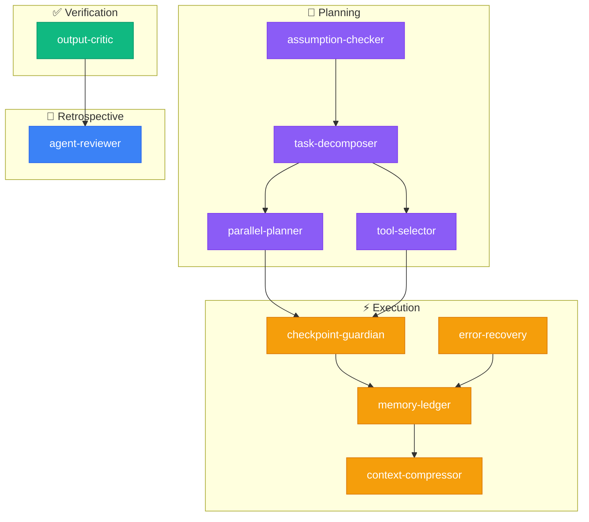

<div align="center">

# 🛠️ fth-skills

**Curated AI agent skills for coding workflows, decision-making, and agentic task safety**

[](LICENSE)
[](#-available-skills)
[](https://skills.sh/)

*Reusable instruction packs for the [skills.sh](https://skills.sh/) ecosystem — works with Claude Code, Cursor, Copilot, Gemini CLI, and more.*

</div>

---

## ⚡ Quick Install

```bash
# Install all skills
npx skills add fatih-developer/fth-skills

# Install a single skill
npx skills add fatih-developer/fth-skills --skill <skill-name>
```

---

## 🎯 Available Skills

### Agentic Ecosystem (10 skills)

End-to-end decision and execution ecosystem for agentic tasks. Each skill covers a phase of the task lifecycle:

| Skill | Phase | Install | Description |
|-------|-------|---------|-------------|
| **assumption-checker** | Planning | `--skill assumption-checker` | Surface and verify agent assumptions (technical, data, logic, intent) before acting. |
| **task-decomposer** | Planning | `--skill task-decomposer` | Break complex tasks into subtasks with dependency maps, execution order, and progress tracking. |
| **parallel-planner** | Planning | `--skill parallel-planner` | Identify parallelizable steps, build dependency graphs, detect conflicts, optimize execution order. |
| **tool-selector** | Planning | `--skill tool-selector` | Select optimal tools, plan call sequence, prevent unnecessary tool invocations. |
| **checkpoint-guardian** | Execution | `--skill checkpoint-guardian` | Risk assessment before critical actions. Classifies risk (LOW/MEDIUM/HIGH), requires confirmation, produces audit trail. |
| **memory-ledger** | Execution | `--skill memory-ledger` | Structured task memory — tracks decisions, bugs, status, and preferences throughout multi-step tasks. |
| **error-recovery** | Execution | `--skill error-recovery` | Classify errors (transient/config/logic/permanent), apply recovery strategies, escalate when exhausted. |
| **context-compressor** | Execution | `--skill context-compressor` | Compress context by 70% while preserving decisions, errors, and critical data. |
| **output-critic** | Verification | `--skill output-critic` | Score output quality by type-specific criteria (code, report, plan, data), accept/reject gate. |
| **agent-reviewer** | Retrospective | `--skill agent-reviewer` | Post-task retrospective across 6 dimensions with skill performance evaluation. |

### Specialized Skills

| Skill | Install | Description |
|-------|---------|-------------|
| **multi-brain** | `--skill multi-brain` | Evaluate requests from 3 independent perspectives (Creative, Pragmatic, Comprehensive), reach consensus, produce complete output. |
| **react-flow** | `--skill react-flow` | Audit, repair, migrate, and scaffold `@xyflow/react` projects with typed patterns and safe auto-fix workflow. |

### Experimental (Preview)

| Skill | Install | Description |
|-------|---------|-------------|
| **multi-brain-experts** | `--skill multi-brain-experts` | Domain-specific expert perspectives. Auto-selects 3 experts from a pool of 16 (Security, Performance, UX, Cost...). |
| **multi-brain-debate** | `--skill multi-brain-debate` | Two-round adversarial debate: positions → challenges & rebuttals → verdict. |
| **multi-brain-score** | `--skill multi-brain-score` | Confidence scoring (1-10) per perspective with weighted consensus and uncertainty flags. |

> **Experimental skills** are fully functional but may evolve. They graduate to curated once stable.

---

## 🧩 Ecosystem Architecture

The 10 agentic skills work together across 5 phases of a task lifecycle:



Each skill can also be used independently — the ecosystem is not all-or-nothing.

---

## 📁 Repository Structure

```
fth-skills/
├── skills/
│   ├── .curated/           # Stable, production-ready
│   │   ├── agent-reviewer/
│   │   ├── assumption-checker/
│   │   ├── checkpoint-guardian/
│   │   ├── context-compressor/
│   │   ├── error-recovery/
│   │   ├── memory-ledger/
│   │   ├── multi-brain/
│   │   ├── output-critic/
│   │   ├── parallel-planner/
│   │   ├── react-flow/
│   │   ├── task-decomposer/
│   │   └── tool-selector/
│   └── .experimental/      # Preview, may evolve
│       ├── multi-brain-experts/
│       ├── multi-brain-debate/
│       └── multi-brain-score/
├── scripts/
│   └── validate_curated_skills.py
├── README.md
└── LICENSE
```

Each skill folder contains:
- `SKILL.md` — Main instruction file (required)
- `references/` — Supporting docs, checklists, examples
- `templates/` — Reusable output templates
- `agents/` — Agent platform manifests (OpenAI, etc.)

---

## 🤝 Contributing

1. Create a folder under `skills/.curated/<name>/` or `skills/.experimental/<name>/`
2. Add `SKILL.md` with frontmatter:
   ```yaml
   ---
   name: skill-name
   description: What it does and when it should trigger.
   ---
   ```
3. Add supporting folders as needed: `references/`, `templates/`, `agents/`
4. Run validation:
   ```bash
   python scripts/validate_curated_skills.py
   python scripts/validate_curated_skills.py --root skills/.experimental
   ```
5. Update this README and submit a PR

---

## License

MIT
