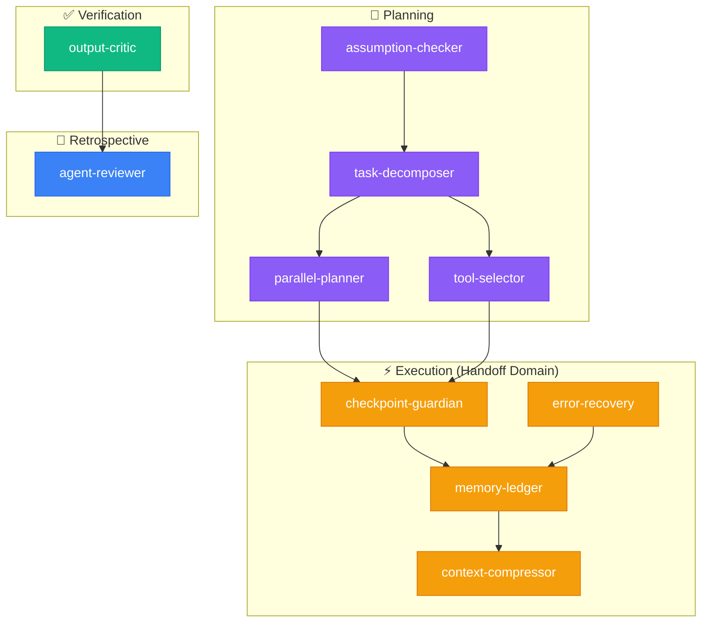

<div align="center">

# 🛠️ fth-skills

**Curated AI agent skills for coding workflows, decision-making, and agentic task safety**

[](LICENSE)
[](#-available-skills)
[](https://skills.sh/)

_Reusable instruction packs for the [skills.sh](https://skills.sh/) ecosystem — works with Claude Code, Cursor, Copilot, Gemini CLI, and more._

</div>

---

## ⚡ Quick Install

```bash
# Install all skills
npx skills add fatih-developer/fth-skills

# Install a single skill
npx skills add fatih-developer/fth-skills --skill <skill-name>
```

---

## 🎯 Available Skills (45 Curated)

The repository is structured into a **Layered Monorepo Architecture**, highly optimized for the **Ecosystem Handoff Pattern**. Skills are not just isolated commands; they are orchestrated capabilities acting together.

### 💼 Domain Ecosystems

Every domain folder (`mobile`, `api`, `database`) contains an `ECOSYSTEM.md` map. Orchestrator agents (like `task-decomposer` and `parallel-planner`) read these maps dynamically to understand the **exact sequence of skills required for complex workflows** (e.g., OpenAPI-First Design Flow, Pre-Launch Release Handoffs).

#### 📱 Mobile App Domain (`domains/mobile`)

| Skill                         | Install                             | Description                                                                        |
| ----------------------------- | ----------------------------------- | ---------------------------------------------------------------------------------- |
| **accessibility-enforcer**    | `--skill accessibility-enforcer`    | Audits UI for VoiceOver/TalkBack & WCAG compliance.                                |
| **app-store-reviewer**        | `--skill app-store-reviewer`        | Prepares app metadata, screenshots, and compliance checks for submission.          |
| **crash-analyst**             | `--skill crash-analyst`             | Analyzes stack traces and symbolication to pinpoint root causes.                   |
| **deep-link-architect**       | `--skill deep-link-architect`       | Maps universal links and intent routing across iOS and Android.                    |
| **mobile-perf-auditor**       | `--skill mobile-perf-auditor`       | Evaluates bundle size, memory leaks, and frame drops.                              |
| **mobile-security-auditor**   | `--skill mobile-security-auditor`   | Discovers insecure local storage, exposed API keys, and reverse-engineering risks. |
| **offline-sync-designer**     | `--skill offline-sync-designer`     | Designs local-first data persistence and conflict resolution.                      |
| **onboarding-designer**       | `--skill onboarding-designer`       | Optimizes the first-time user experience and permission funnel.                    |
| **push-notification-planner** | `--skill push-notification-planner` | Architects APNs/FCM payloads, deep-linking, and badge management.                  |
| **release-orchestrator**      | `--skill release-orchestrator`      | Manages semantic versioning, staged rollouts, and changelog generation.            |

#### 🌐 API Domain (`domains/api`)

| Skill                         | Install                             | Description                                                                      |
| ----------------------------- | ----------------------------------- | -------------------------------------------------------------------------------- |
| **api-mock-designer**         | `--skill api-mock-designer`         | Scaffolds mock servers and JSON response payloads based on the contract.         |
| **api-observability-planner** | `--skill api-observability-planner` | Defines logging, tracing, and metric alerts for the API boundary.                |
| **auth-flow-designer**        | `--skill auth-flow-designer`        | Designs robust OAuth2, JWT, and session-based authentication mechanisms.         |
| **breaking-change-detector**  | `--skill breaking-change-detector`  | Flags backward-incompatible payload or endpoint changes.                         |
| **changelog-generator**       | `--skill changelog-generator`       | Compiles developer-friendly release notes mapping the API changes.               |
| **contract-first-designer**   | `--skill contract-first-designer`   | Designs OpenAPI/AsyncAPI specifications before writing any code.                 |
| **protocol-selector**         | `--skill protocol-selector`         | Evaluates REST vs GraphQL vs gRPC based on usage requirements.                   |
| **rate-limit-strategist**     | `--skill rate-limit-strategist`     | Prevents abuse by designing throttling, rate-limiting, and quota rules.          |
| **sdk-scaffolder**            | `--skill sdk-scaffolder`            | Scaffolds client SDKs and typed interfaces (e.g., TypeScript) from the contract. |
| **webhook-architect**         | `--skill webhook-architect`         | Architects event-driven webhook dispatches and retry mechanisms.                 |

#### 🗄️ Database Domain (`domains/database`)

| Skill                      | Install                          | Description                                                            |
| -------------------------- | -------------------------------- | ---------------------------------------------------------------------- |
| **access-policy-designer** | `--skill access-policy-designer` | Designs Row-Level Security (RLS) constraints and access roles.         |
| **data-lineage-tracer**    | `--skill data-lineage-tracer`    | Maps data flow dependencies and transformation pipelines.              |
| **data-masker**            | `--skill data-masker`            | Manages PII redaction and obfuscation for non-production environments. |
| **index-advisor**          | `--skill index-advisor`          | Recommends covering and composite indexes for slow queries.            |
| **migration-strategist**   | `--skill migration-strategist`   | Designs zero-downtime up/down migration scripts and backfill jobs.     |
| **query-budget-enforcer**  | `--skill query-budget-enforcer`  | Sets N+1 detection rules and maximum execution thresholds.             |
| **query-explainer**        | `--skill query-explainer`        | Analyzes execution plans (EXPLAIN ANALYZE) to identify bottlenecks.    |
| **schema-architect**       | `--skill schema-architect`       | Normalizes DB schema (BCNF/3NF), generates DDL, prevents God Tables.   |
| **schema-diff-analyzer**   | `--skill schema-diff-analyzer`   | Detects drift between environments or declarative definitions.         |
| **seed-data-generator**    | `--skill seed-data-generator`    | Creates deterministic, referentially-intact relationships for testing. |

#### ⚛️ Frameworks (`domains/react-flow`)

| Skill          | Install              | Description                                                    |
| -------------- | -------------------- | -------------------------------------------------------------- |
| **react-flow** | `--skill react-flow` | Audit, repair, migrate, and scaffold `@xyflow/react` projects. |

---

### 🧠 Core Agentic Ecosystem

These foundational skills provide decision-making, safety, orchestration, and analysis. They sit in the `core/`, `planning/`, `execution/`, and analysis layers.

| Skill                   | Layer     | Install                       | Description                                                                                           |
| ----------------------- | --------- | ----------------------------- | ----------------------------------------------------------------------------------------------------- |
| **task-decomposer**     | Planning  | `--skill task-decomposer`     | Break complex tasks into subtasks with dependency maps. Consults `ECOSYSTEM.md` guides automatically. |
| **parallel-planner**    | Planning  | `--skill parallel-planner`    | Identify parallelizable steps, build dependency graphs, detect conflicts.                             |
| **tool-selector**       | Planning  | `--skill tool-selector`       | Select optimal tools, plan call sequence, prevent unnecessary tool invocations.                       |
| **checkpoint-guardian** | Execution | `--skill checkpoint-guardian` | Risk assessment before critical actions. Requires user confirmation for high-risk operations.         |
| **error-recovery**      | Execution | `--skill error-recovery`      | Classify errors (transient/config/logic/permanent) and apply recovery strategies.                     |
| **context-compressor**  | Execution | `--skill context-compressor`  | Compress context by 70% while preserving decisions, errors, and critical data.                        |
| **memory-ledger**       | Core      | `--skill memory-ledger`       | Structured task memory — tracks decisions, bugs, status throughout multi-step tasks.                  |
| **multi-brain**         | Core      | `--skill multi-brain`         | Base multi-perspective analysis orchestration pattern.                                                |
| **output-critic**       | Core      | `--skill output-critic`       | Score output quality by type-specific criteria, accept/reject gate.                                   |
| **assumption-checker**  | Core      | `--skill assumption-checker`  | Surface and verify agent assumptions before acting.                                                   |
| **agent-reviewer**      | Core      | `--skill agent-reviewer`      | Post-task retrospective across 6 dimensions.                                                          |
| **project-analyzer**    | Analysis  | `--skill project-analyzer`    | Deep codebase and architectural analysis reporting tool.                                              |
| **proje-analizcisi**    | Analysis  | `--skill proje-analizcisi`    | Turkish version of the project-analyzer tool.                                                         |

### Experimental (Preview)

| Skill                   | Install                       | Description                                                                                                         |
| ----------------------- | ----------------------------- | ------------------------------------------------------------------------------------------------------------------- |
| **multi-brain-experts** | `--skill multi-brain-experts` | Domain-specific expert perspectives. Auto-selects 3 experts from a pool of 16 (Security, Performance, UX, Cost...). |
| **multi-brain-debate**  | `--skill multi-brain-debate`  | Two-round adversarial debate: positions → challenges & rebuttals → verdict.                                         |
| **multi-brain-score**   | `--skill multi-brain-score`   | Confidence scoring (1-10) per perspective with weighted consensus and uncertainty flags.                            |

> **Experimental skills** are fully functional but may evolve. They graduate to curated once stable.

---

## 🧩 The Ecosystem Paradigm & Hybrid Handoffs

The true power of `fth-skills` lies not in isolated commands, but in its **Ecosystem Paradigm**. Instead of triggering single prompts, skills act as members of a coordinated team using the **Hybrid Handoff Pattern**.

1. **Domain Ecosystem Guides (`ECOSYSTEM.md`):** Every domain contains a master blueprint defining standard, multi-stage workflows. (e.g., The _OpenAPI-First Design Flow_ routes sequentially through 3 distinct skills).
2. **Planner Awareness:** Central orchestrators (like `task-decomposer`) are programmed to dynamically read the relevant `ECOSYSTEM.md` file _before_ taking action, strictly aligning their execution plans to the defined ecosystem logic.
3. **Skill-to-Skill Handoffs:** Individual skills (`SKILL.md`) specify internal `🔗 Next Steps` logic. For example: When `schema-architect` finishes normalizing tables and generating DDL, it **automatically hands the execution context** downstream to `access-policy-designer` to secure them.

### Core Lifecycle Graph


```mermaid
graph TD
    subgraph "📐 Planning"
        AC["assumption-checker"] --> TD["task-decomposer"]
        TD --> PP["parallel-planner"]
        TD --> TS["tool-selector"]
    end

    subgraph "⚡ Execution (Handoff Domain)"
        CG["checkpoint-guardian"]
        ML["memory-ledger"]
        ER["error-recovery"]
        CC["context-compressor"]
    end

    subgraph "✅ Verification"
        OC["output-critic"]
    end

    subgraph "🔄 Retrospective"
        AR["agent-reviewer"]
    end

    PP --> CG
    TS --> CG
    CG --> ML
    ER --> ML
    ML --> CC
    OC --> AR

    style AC fill:#8b5cf6,stroke:#7c3aed,color:#fff
    style TD fill:#8b5cf6,stroke:#7c3aed,color:#fff
    style PP fill:#8b5cf6,stroke:#7c3aed,color:#fff
    style TS fill:#8b5cf6,stroke:#7c3aed,color:#fff
    style CG fill:#f59e0b,stroke:#d97706,color:#fff
    style ML fill:#f59e0b,stroke:#d97706,color:#fff
    style ER fill:#f59e0b,stroke:#d97706,color:#fff
    style CC fill:#f59e0b,stroke:#d97706,color:#fff
    style OC fill:#10b981,stroke:#059669,color:#fff
    style AR fill:#3b82f6,stroke:#2563eb,color:#fff
```

_Existing environments utilizing the flat structure (e.g., `npx skills add --skill tool-selector`) are completely supported via **100% backward-compatible root symlinks** within `.curated/`._

---

## 📁 Repository Structure

```
fth-skills/
├── skills/
│   ├── .curated/           # Layered Monorepo Architecture
│   │   │                     # (Symlinks reside here for backward compatibility)
│   │   ├── core/           # Foundational agents (multi-brain, etc)
│   │   ├── execution/      # Runtime safety (checkpoint-guardian...)
│   │   ├── planning/       # Orchestrators (task-decomposer...)
│   │   ├── domains/
│   │   │   ├── api/        # 10 skills + ECOSYSTEM.md workflows
│   │   │   ├── database/   # 10 skills + ECOSYSTEM.md workflows
│   │   │   ├── mobile/     # 10 skills + ECOSYSTEM.md workflows
│   │   │   └── react-flow/ # UI Framework skills
│   │   ├── proje-analizcisi/
│   │   └── project-analyzer/
│   └── .experimental/      # Preview, may evolve
│       ├── multi-brain-experts/
│       ├── multi-brain-debate/
│       └── multi-brain-score/
├── scripts/
│   └── validate_curated_skills.py
├── README.md
└── LICENSE
```

Each skill folder contains:

- `SKILL.md` — Main instruction file (required)
- `references/` — Supporting docs, checklists, examples
- `templates/` — Reusable output templates
- `agents/` — Agent platform manifests (OpenAI, etc.)

---

## 🤝 Contributing

1. Create a folder under `skills/.curated/<domain>/<name>/` or `skills/.experimental/<name>/`
2. Add `SKILL.md` with frontmatter:
   ```yaml
   ---
   name: skill-name
   description: What it does and when it should trigger.
   ---
   ```
3. Add supporting folders as needed: `references/`, `templates/`, `agents/`
4. Run validation:
   ```bash
   python scripts/validate_curated_skills.py
   python scripts/validate_curated_skills.py --root skills/.experimental
   ```
5. Update this README and submit a PR

---

## License

MIT
