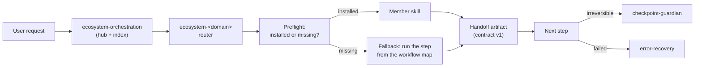

<div align="center">

# 🛠️ fth-skills

**Curated AI agent skills for coding workflows, decision-making, and agentic task safety**

[](LICENSE)
[](#-available-skills)
[](https://skills.sh/)

_Reusable instruction packs for the [skills.sh](https://skills.sh/) ecosystem — works with Claude Code, Cursor, Copilot, Gemini CLI, and more._

</div>

---

## ⚡ Quick Install

### skills.sh

```bash
# Install all skills
npx skills add fatih-developer/fth-skills

# Install a single skill
npx skills add fatih-developer/fth-skills --skill <skill-name>
```

### Hermes Agent

```bash
# Add this repository as a reusable skill tap
hermes skills tap add fatih-developer/fth-skills

# Search the tap from Hermes
hermes skills search <query>

# Install a single skill from the tap
hermes skills install fatih-developer/fth-skills/<skill-name>

# Example
hermes skills install fatih-developer/fth-skills/project-analyzer
```

### ClawHub

```bash
# Install and authenticate the ClawHub CLI
npm i -g clawhub
clawhub login
clawhub whoami

# Validate the public ClawHub publish list
python scripts/publish_clawhub.py --check-only

# Dry-run all public skills listed in skills.sh.json
python scripts/publish_clawhub.py

# Dry-run one skill
python scripts/publish_clawhub.py --skill project-analyzer

# Publish one skill after reviewing the dry-run output
python scripts/publish_clawhub.py --skill project-analyzer --execute

# Publish all public skills after a successful single-skill smoke test
python scripts/publish_clawhub.py --execute

# Inspect scanner results and published files
npx clawhub inspect <skill-slug> --files
```

---

## 🎯 Available Skills (79 Public)

Skills are grouped into **ecosystems**. Each ecosystem has a hub skill (`ecosystem-*`) that picks a workflow, checks which member skills are installed, runs them in order with explicit handoffs, and falls back gracefully when a member is missing. Install a hub to get the routing, then add members as you need them.

<!-- BEGIN GENERATED: skill-catalog (generated from the ecosystem workflow map by build_ecosystems.py — do not edit by hand) -->
### Agent Orchestration (16 + hub)

_Plan, execute, recover, remember, and review multi-step agent work; connect external agents safely._ Workflows: `orch-complex-task`, `orch-code-change`, `orch-resilience`, `orch-agent-connectivity`, `orch-knowledge`.

| Skill | Install | Description |
|---|---|---|
| **ecosystem-orchestration** | `--skill ecosystem-orchestration` | Cross-ecosystem index plus agent workflows: complex tasks, code changes, recovery, connectivity, knowledge capture. |
| **task-decomposer** | `--skill task-decomposer` | Breaks large tasks into subtasks with dependencies, order, and success criteria. |
| **parallel-planner** | `--skill parallel-planner` | Identify parallelizable steps, build dependency graphs, and optimize execution order. |
| **tool-selector** | `--skill tool-selector` | Select optimal tools, plan execution order, and prevent unnecessary tool calls. |
| **plan-implement-verify-recover** | `--skill plan-implement-verify-recover` | Plans, implements, verifies, and recovers repository changes at the right risk level. |
| **checkpoint-guardian** | `--skill checkpoint-guardian` | Risk assessment and confirmation gates for critical agent actions. |
| **error-recovery** | `--skill error-recovery` | Classify errors and apply the right recovery strategy. No blind retries. |
| **context-compressor** | `--skill context-compressor` | Compress context by 70% while preserving critical information. Decisions, errors, and data never lost. |
| **memory-ledger** | `--skill memory-ledger` | Structured task memory — tracks decisions, bugs, status, and preferences throughout multi-step tasks. |
| **session-transfer** | `--skill session-transfer` | Saves and resumes immutable, indexed session handoffs across Claude Code, Codex, and OpenCode. |
| **mastermind-logger** | `--skill mastermind-logger` | Keeps a cross-referenced project knowledge wiki updated with durable learnings. |
| **output-critic** | `--skill output-critic` | Score output quality by type-specific criteria, make accept/reject decisions, suggest improvements. |
| **agent-reviewer** | `--skill agent-reviewer` | Post-task retrospective analysis. Scores performance across 6 dimensions and produces improvement recommendations. |
| **jev-orchestrator** | `--skill jev-orchestrator` | Invoke TypeSafe Jev for bounded semantic decisions: classification, routing, grading, RAG relevance, escalation. |
| **claw-integration-design** | `--skill claw-integration-design` | Design secure APIs and tool manifests for integrating external bots and agents (OpenClaw, LangChain, OpenAI) with web applications. |
| **project-analyzer** | `--skill project-analyzer` | Evidence-based codebase analysis: overview, architecture, code quality, risks, and API endpoint reports. |
| **skill-comparator** | `--skill skill-comparator` | Analyzes and compares existing skills across 10 dimensions to recommend adopt, adapt, or build configurations. |

### Reasoning, Planning Gates & Prompting (10 + hub)

_Clarify intent, stress-test plans, compare perspectives, and craft prompts, without stacking redundant question gates._ Workflows: `reason-clarify`, `reason-decision`, `reason-plan-review`, `reason-prompting`.

| Skill | Install | Description |
|---|---|---|
| **ecosystem-reasoning** | `--skill ecosystem-reasoning` | Reasoning workflows: one clarification gate, decision quality, plan hardening, and prompt engineering. |
| **project-focus-first** | `--skill project-focus-first` | Force establishing and preserving the primary focus category before discussing any new project. |
| **ask-first-act-later** | `--skill ask-first-act-later` | Consultant mode: asks targeted questions and waits before implementing anything. |
| **assumption-checker** | `--skill assumption-checker` | Surface and verify agent assumptions before acting. Prevents building on wrong foundations. |
| **plan-hardener** | `--skill plan-hardener` | Assumption-first architecture review skill to stress-test project plans and expose hidden risks. |
| **multi-brain** | `--skill multi-brain` | Evaluate requests from 3 perspectives, reach consensus, and deliver complete outputs. |
| **multi-brain-experts** | `--skill multi-brain-experts` | Domain-specific expert perspectives for technical decisions. |
| **multi-brain-debate** | `--skill multi-brain-debate` | Two-round adversarial debate for high-stakes decisions. |
| **multi-brain-score** | `--skill multi-brain-score` | Confidence-scored multi-perspective decisions with uncertainty flags. |
| **prompt-crafter** | `--skill prompt-crafter` | Creates, improves, critiques, and structures prompts, agents, workflows, and MCP-oriented prompt packages. |
| **turkish-prompt-compiler** | `--skill turkish-prompt-compiler` | Türkçe promptları ölçerek güvenle sıkıştırır |

### API Domain (10 + hub)

_Design, secure, scale, and evolve REST, GraphQL, gRPC, and event-driven APIs with a contract-first workflow._ Workflows: `api-design`, `api-security-scale`, `api-evolution`, `api-production-readiness`.

| Skill | Install | Description |
|---|---|---|
| **ecosystem-api** | `--skill ecosystem-api` | API workflows: contract-first design, security and scale, evolution, and production readiness. |
| **protocol-selector** | `--skill protocol-selector` | Chooses REST, GraphQL, gRPC, or event-driven APIs with a trade-off table. |
| **contract-first-designer** | `--skill contract-first-designer` | Writes OpenAPI/AsyncAPI contracts and contract tests before any code. |
| **api-mock-designer** | `--skill api-mock-designer` | Designs stateful API mocks and example payloads, including error and edge cases. |
| **sdk-scaffolder** | `--skill sdk-scaffolder` | Scaffolds idiomatic Python, TypeScript, Go, or Kotlin SDKs from an OpenAPI spec. |
| **auth-flow-designer** | `--skill auth-flow-designer` | Chooses API keys, JWT, OAuth2, or mTLS and designs token lifecycles and scopes. |
| **rate-limit-strategist** | `--skill rate-limit-strategist` | Designs rate limits and quotas: algorithm, scope, headers, and 429 behavior. |
| **breaking-change-detector** | `--skill breaking-change-detector` | Compares two OpenAPI/API specification versions (V1 vs V2) to detect breaking changes and backward compatibility issues. |
| **changelog-generator** | `--skill changelog-generator` | Analyzes commit history, PR descriptions, and spec changes to automatically generate developer-friendly API changelogs. |
| **webhook-architect** | `--skill webhook-architect` | Designs signed, retried, idempotent outbound webhooks with a dead-letter queue. |
| **api-observability-planner** | `--skill api-observability-planner` | Plans API metrics, structured logs, distributed tracing, and SLO alerts. |

### Database Domain (12 + hub)

_Model, secure, optimize, migrate, and operate SQL databases (PostgreSQL, MySQL, SQLite) with data integrity first._ Workflows: `db-new-schema`, `db-performance`, `db-evolution`, `db-compliance`, `db-scaling`.

| Skill | Install | Description |
|---|---|---|
| **ecosystem-database** | `--skill ecosystem-database` | Database workflows: schema design, performance, evolution, compliance, and connection scaling. |
| **schema-architect** | `--skill schema-architect` | Turns business requirements into a normalized schema and dialect-specific DDL. |
| **access-policy-designer** | `--skill access-policy-designer` | Designs RLS, column-level security, and RBAC/ABAC policies with ready-to-run DDL. |
| **seed-data-generator** | `--skill seed-data-generator` | Generates realistic test data preserving referential integrity. Reads schemas, foreign keys, and builds relationships. |
| **query-explainer** | `--skill query-explainer` | Explains EXPLAIN ANALYZE plans in plain language and points to the fix. |
| **index-advisor** | `--skill index-advisor` | Recommends missing, composite, covering, and removable indexes for slow queries. |
| **query-budget-enforcer** | `--skill query-budget-enforcer` | Sets query cost and row-scan budgets and detects N+1 patterns. |
| **schema-diff-analyzer** | `--skill schema-diff-analyzer` | Finds schema drift between environments and plans a risk-ordered sync. |
| **migration-strategist** | `--skill migration-strategist` | Plans zero-downtime expand/contract schema migrations with backfill and rollback. |
| **data-masker** | `--skill data-masker` | Detects PII and masks production data for safe test and staging copies. |
| **data-lineage-tracer** | `--skill data-lineage-tracer` | Traces upstream and downstream lineage of tables and columns and their blast radius. |
| **pgbouncer-architect** | `--skill pgbouncer-architect` | Designs and configures PgBouncer connection pooling for PostgreSQL based on actual workload analysis. |
| **sqlite** | `--skill sqlite` | SQLite schema design, PRAGMA tuning, migrations (Drizzle/raw), performance optimization, WAL mode, FTS5, sqlite-vec, and cloud SQLite (Turso/D1). |

### Mobile App Domain (10 + hub)

_Architect, audit, release, and monitor iOS, Android, React Native, and Flutter apps._ Workflows: `mobile-pre-release-audit`, `mobile-release`, `mobile-feature-architecture`, `mobile-post-launch`.

| Skill | Install | Description |
|---|---|---|
| **ecosystem-mobile** | `--skill ecosystem-mobile` | Mobile workflows: pre-release audit, store release, feature architecture, and post-launch monitoring. |
| **accessibility-enforcer** | `--skill accessibility-enforcer` | Audits mobile UI for VoiceOver, TalkBack, and WCAG issues and proposes accessible code. |
| **mobile-perf-auditor** | `--skill mobile-perf-auditor` | Diagnoses mobile cold start, jank, memory, battery, and bundle-size problems. |
| **mobile-security-auditor** | `--skill mobile-security-auditor` | Audits mobile apps against OWASP Mobile Top 10 with remediation code. |
| **app-store-reviewer** | `--skill app-store-reviewer` | Checks apps against App Store and Play Store guidelines and fixes store metadata. |
| **release-orchestrator** | `--skill release-orchestrator` | Plans mobile versions, changelogs, beta tracks, and staged rollouts. |
| **deep-link-architect** | `--skill deep-link-architect` | Designs Universal Links and App Links with routing, fallbacks, and tests. |
| **push-notification-planner** | `--skill push-notification-planner` | Plans APNs/FCM payloads, permission timing, tap routing, and analytics. |
| **offline-sync-designer** | `--skill offline-sync-designer` | Designs offline storage, optimistic UI, conflict resolution, and background sync. |
| **onboarding-designer** | `--skill onboarding-designer` | Designs mobile first-run flows, permission sequencing, and early retention hooks. |
| **crash-analyst** | `--skill crash-analyst` | Symbolicates mobile crash reports, finds the root cause, and proposes a fix. |

### Web, Design & Delivery (7 + hub)

_Design product-grade web interfaces, keep design systems consistent, make sites visible to search and AI answer engines, and deploy them._ Workflows: `web-build-page`, `web-visibility`, `web-review`, `web-deploy`.

| Skill | Install | Description |
|---|---|---|
| **ecosystem-web** | `--skill ecosystem-web` | Web workflows: page build, search and AI visibility, UI review, and deploy with verification. |
| **claude-style-coding** | `--skill claude-style-coding` | Product-minded implementation with user journey, UX states, and visual polish first. |
| **design-intelligence** | `--skill design-intelligence` | Generates or reviews web pages with a 12-category, accessibility-aware design rubric. |
| **design-md-enforcer** | `--skill design-md-enforcer` | Enforce and manage DESIGN.md specifications, combining design reasoning with token roles. |
| **react-flow** | `--skill react-flow` | Audit, repair, migrate, and scaffold React Flow projects. |
| **geo-auditor** | `--skill geo-auditor` | Codeless GEO and SEO audits on live sites |
| **geo-optimizer** | `--skill geo-optimizer` | Improves visibility in AI and classic searches |
| **coolify-orchestrator** | `--skill coolify-orchestrator` | Expert Coolify management skill for self-hosted infrastructure. Deploy, manage, and debug services. |

### Product & Growth (3 + hub)

_Take a product from focus to market: B2B go-to-market, naming, creative content, and discoverability._ Workflows: `product-launch`, `product-naming`, `product-content`.

| Skill | Install | Description |
|---|---|---|
| **ecosystem-product** | `--skill ecosystem-product` | Product workflows: launch, naming and positioning, and creative content. |
| **b2b-founder-roadmap** | `--skill b2b-founder-roadmap` | Stage-gated B2B go-to-market: validate demand, win first customers, and grow revenue. |
| **brand-name-lab** | `--skill brand-name-lab` | Generates strategic and verifiable brand names. |
| **ugc-crafter** | `--skill ugc-crafter` | Writes prompts for authentic, smartphone-style UGC images and videos with consistent characters. |

### Security (3 + hub)

_Audit skills before deployment, guard agent runtimes against injection and exfiltration, and learn from incidents._ Workflows: `sec-skill-audit`, `sec-runtime-guard`, `sec-full-lifecycle`.

| Skill | Install | Description |
|---|---|---|
| **ecosystem-security** | `--skill ecosystem-security` | Security workflows: skill audit and trust, runtime guard, and the full security lifecycle. |
| **security-auditor** | `--skill security-auditor` | Audits skills for vulnerabilities, calculates Trust Scores (0-100), and generates runtime guard rules. |
| **adaptive-guard** | `--skill adaptive-guard` | Real-time 5-tier message protection with async rule learning. Prevents prompt injection, exfiltration, and command injection. |
| **security-orchestrator** | `--skill security-orchestrator` | Coordinates security-auditor and adaptive-guard for full-lifecycle security management. |

### Deprecated aliases

Kept so existing installs keep working. They route to the canonical skill and never trigger implicitly.

| Alias | Use instead |
|---|---|
| `proje-analizcisi` | `project-analyzer` |
| `skill-security` | `security-auditor` |
<!-- END GENERATED: skill-catalog -->

---

## 🧩 How the Ecosystems Work


```mermaid
graph LR
    U["User request"] --> H["ecosystem-orchestration<br/>(hub + index)"]
    H --> E["ecosystem-&lt;domain&gt;<br/>router"]
    E --> P["Preflight:<br/>installed or missing?"]
    P -->|installed| S["Member skill"]
    P -->|missing| F["Fallback: run the step<br/>from the workflow map"]
    S --> A["Handoff artifact<br/>(contract v1)"]
    F --> A
    A --> N["Next step"]
    N -->|irreversible| G["checkpoint-guardian"]
    N -->|failed| R["error-recovery"]
```

1. **One source of truth.** Every ecosystem keeps its map in `skills/ecosystem-<domain>/references/workflows.json`: members, workflows, steps (with *Does*, *Done when*, conditions, parallel groups), direct handoffs, and — for reasoning — gate precedence.
2. **Generated, never drifting.** `scripts/build_ecosystems.py` renders the router, catalog, and workflow sections of each hub, the `🔗 Next Steps & Handoffs` section of every member skill, the ecosystem index inside `task-decomposer` and `parallel-planner`, the `skills.sh.json` groupings, and this README catalog. `--check` fails CI when anything is out of date.
3. **Graceful degradation.** A missing member never blocks a workflow. The hub offers to install it (`scripts/install_all.py` is a dry run until `--execute`) or runs the step itself in *fallback* mode.
4. **Handoff contract.** Steps pass results through a small JSON envelope (`skill`, `workflow`, `created_at`, `inputs`, `summary`, `outputs`, `next`), in files for workflow runs and inline for quick questions. See `references/handoff-contract.md` in any hub.
5. **Safety built in.** Irreversible or production-impacting steps stop at `checkpoint-guardian`; failures go to `error-recovery`; only one clarification gate runs per request.

---

## 📁 Repository Structure

```
fth-skills/
├── skills/
│   ├── ecosystem-<domain>/            # hub: router + workflow map
│   │   ├── SKILL.md                   # generated blocks + hand-written intro
│   │   ├── references/
│   │   │   ├── workflows.json         # source of truth for the domain
│   │   │   └── handoff-contract.md    # generated from scripts/templates
│   │   └── scripts/install_all.py     # generated; dry-run installer
│   └── <skill-name>/
│       ├── SKILL.md                   # frontmatter + instructions + generated handoffs
│       ├── agents/openai.yaml         # required for skills.sh discovery
│       ├── references/ templates/ scripts/ assets/   # optional
│       └── evals/                     # optional trigger and behavior evals
├── scripts/
│   ├── build_ecosystems.py            # renders every ecosystem-derived artifact
│   ├── validate_curated_skills.py     # structural validator (run in CI)
│   ├── templates/ecosystem/           # installer + handoff contract templates
│   └── ...
├── skills.sh.json                     # generated groupings
└── .github/workflows/validate.yml     # CI: build --check + validator + tests
```

---

## 🤝 Contributing

1. Create `skills/<skill-name>/SKILL.md` with frontmatter. The description must say what the skill does **and when to use it**:
   ```yaml
   ---
   name: skill-name
   description: "What it does. Use when ..."
   ---
   ```
2. Add `skills/<skill-name>/agents/openai.yaml` with `display_name`, a complete `short_description` (no trailing `...`), and a `default_prompt` that mentions `$skill-name`.
3. Add the skill to one ecosystem's `references/workflows.json` (as a member, and in workflows or handoffs where it belongs).
4. Regenerate and validate:
   ```bash
   python scripts/build_ecosystems.py
   python scripts/validate_curated_skills.py
   ```
5. Commit the regenerated files together with your change and open a PR. CI runs the same checks.

---

## License

MIT
