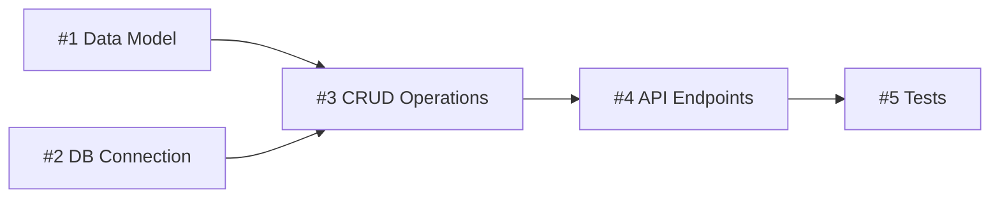

# Task Decomposer Protocol

Break a complex task into independently executable, verifiable subtasks. Produce a structured plan first, get approval, then execute step by step with progress tracking.

---

## Workflow

```
1. Analyze the task
2. Decompose into subtasks (with dependency map)
3. Present the plan and get approval
4. Execute sequentially — complete each step before moving to next
5. Produce summary report
```

---

## Step 1: Analyze the Task

Before decomposing, answer these questions:

- **What is the goal?** What does success look like?
- **What is the scope?** What is included, what is excluded?
- **Are there constraints?** Technology, time, dependencies?
- **Is anything unclear?** If so, ask **one** clarifying question — never multiple.

Do not generate subtasks until the task is clearly understood.

---

## Step 2: Decompose into Subtasks

Each subtask must meet these criteria:

- **Atomic**: Does one thing, contains no internal decision branches
- **Verifiable**: You can definitively say "done" when completed
- **Independent (when possible)**: Can run without waiting for other subtasks
- **Has a concrete output**: A file, a function, a document, a decision

### Dependency Map

Define relationships between subtasks:

- **Sequential (->)**: B cannot start until A completes
- **Parallel (||)**: Can run simultaneously — no shared dependencies
- **Optional (?)**: Not core, nice to have

**How to handle parallel steps:**
Group `||` steps together. Complete all steps in the group, then move to the next sequential step.

```
Group A (parallel): #1 || #2 || #3  -> complete all, then continue
Group B (sequential): #4 -> #5 -> #6
```

### Dependency Visualization

Use mermaid for complex dependency graphs:



---

## Step 3: Present the Plan

Show the plan to the user using the format in `templates/task-plan.md.tmpl` and ask for approval.

**Do not start execution without explicit user approval.**

---

## Step 4: Execute Step by Step

After approval, complete each subtask:

1. Before starting, print a header: `### [#N] Task Name`
2. Execute the task — write code, create files, research, document
3. On completion, print: `Completed: [what was produced]`
4. Move to the next subtask

**On failure:**
- Explain the error
- Suggest an alternative path
- Ask the user: "Continue or fix this first?"

**Escalation rule:** If 2 consecutive subtasks fail, stop automatically and ask:
> "2 consecutive steps failed. Should we review the plan together before continuing?"

### Cross-Skill Integration

- **checkpoint-guardian**: During execution, critical actions (file deletion, DB writes, deploys) should trigger risk assessment checkpoints.
- **multi-brain**: For complex subtasks where the approach is unclear, use 3-perspective evaluation before committing to an implementation.

---

## Step 5: Summary Report

When all subtasks are done, present a summary using `templates/task-summary.md.tmpl`.

---

## When to Skip

Do not decompose — respond directly when:
- Single-step, clear task ("translate this file", "fix this bug")
- User already knows the steps and only wants execution
- Task can be completed in under 3 minutes

See `references/SKIP_CONDITIONS.md` for the full decision matrix.

---

## References

- See `references/PLAN_TEMPLATE.md` for the plan output structure.
- See `references/EXAMPLES.md` for worked examples including a real code output.
- See `references/SKIP_CONDITIONS.md` for when to skip decomposition.

## Templates

- Use `templates/task-plan.md.tmpl` for presenting the plan to the user.
- Use `templates/task-summary.md.tmpl` for the completion report.
