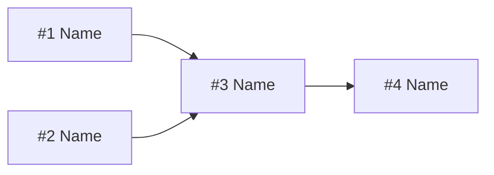

# Plan Template

Standard structure for presenting a task plan to the user.

---

## Required Sections

### 1. Header

```markdown
## Task Plan: [Task Name]

**Goal:** [One sentence]
**Total subtasks:** [N]
**Execution order:** [brief description of sequential/parallel mix]
```

### 2. Subtask Table

```markdown
| # | Task | Depends On | Output | Priority |
|---|------|------------|--------|----------|
| 1 | ...  | —          | ...    | Required |
| 2 | ...  | #1         | ...    | Required |
| 3 | ...  | #1, #2     | ...    | Optional |
```

### 3. Dependency Graph

For 4+ subtasks, include a mermaid visualization:



### 4. Approval Prompt

Always end with:

```
Proceed with this plan, or would you like to change anything?
```

---

## Priority Levels

| Priority | Meaning |
|----------|---------|
| **Required** | Must be completed for the task to succeed |
| **Optional** | Enhances the result but can be skipped |
| **Stretch** | Only if time/scope allows |
