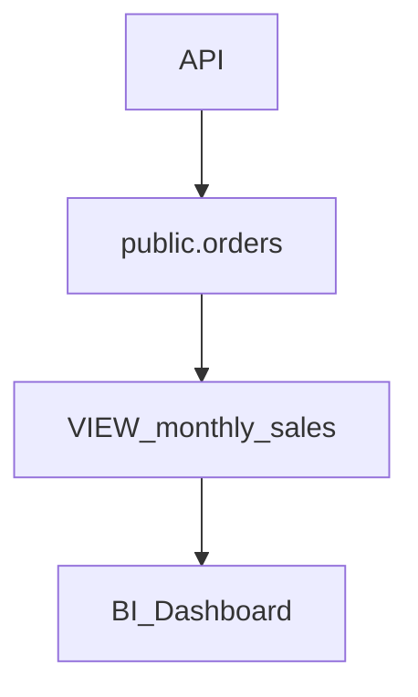

# Data Lineage Tracer Protocol

This skill answers the critical question: *"If I change this column, who dies?"* It traces the flow of data backward (Upstream) to its source, and forward (Downstream) to its consumers.

**Core assumption:** Data does not exist in a vacuum. It flows through Views, Materialized Views, Stored Procedures, Triggers, and ORM boundaries.

---

## 1. Upstream & Downstream Mapping (Static vs Dynamic)

- **Default (Static):** Analyze based on provided `.sql`, schema files, and application ORM code (e.g. Prisma models).
- **Dynamic (On-Demand):** Only connect to the database to inspect dynamic dependencies (e.g. live `pg_views` or `information_schema.triggers`) if requested explicitly.
If assessing `reporting.daily_sales.total_amount`:
- Is it a physical physical or a computed column?
- Does a `VIEW` project it directly from `public.orders`?
- Is it populated via a daily `INSERT INTO ... SELECT` cron job?

### Downstream Tracing (Who uses it?)
If dropping `public.users.phone_number`:
- Is there a `VIEW` that will become invalid (breaking the DB)?
- Is there a Database Trigger relying on it?
- Is there an ORM/GraphQL endpoint or REST Serializer exposing it?

## 2. Dependency Risk Assessment
Categorize the objects affected by a hypothetical change:
- **Hard Dependencies (DB Level):** Views, Materialized Views, Foreign Keys, Stored Procedures. (Will hard-crash the database operations).
- **Soft Dependencies (App Level):** ORM models, API serializers, BI tool dashboards. (Will crash the app layer).

## 3. Visual Output Generation

Provide a clear trace map using Markdown or Mermaid.js so the developer can visualize the blast radius.

**Required Outputs (Must write BOTH to `docs/database-report/`):**

1. **Human-Readable Markdown (`docs/database-report/data-lineage-report.md`)**
```markdown
### 🗺️ Data Lineage for `orders.customer_id`

**Upstream (Writers):**
- ⬅️ Written by `process_payment()` Stored Procedure.
- ⬅️ Populated via API Endpoint `POST /api/v1/checkout`.

**Downstream (Readers/Dependents):**
- ➡️ `VIEW analytics.monthly_cohorts` (Hard dependency - will BREAK if column is dropped).
- ➡️ `TRIGGER sync_to_crm_on_update` (Hard dependency).
- ➡️ Metabase BI Dashboard (Soft dependency).

### ⚠️ Blast Radius Warning
If you rename or modify the type of `customer_id`:
1. The `monthly_cohorts` view must be re-created via `CREATE OR REPLACE VIEW`.
2. The trigger `sync_to_crm_on_update` must be updated to reference the new name.
```

2. **Machine-Readable JSON (`docs/database-report/data-lineage-output.json`)**
```json
{
  "skill": "data-lineage-tracer",
  "target": "orders.customer_id",
  "upstream": ["process_payment()", "POST /api/v1/checkout"],
  "downstream": [
    {"type": "hard", "entity": "VIEW analytics.monthly_cohorts"},
    {"type": "hard", "entity": "TRIGGER sync_to_crm_on_update"}
  ],
  "blast_radius_risk": "High"
}
```

*(Optional: Output a Mermaid graph if requested for complex ETL chains)*


---

## Guardrails
- **Incomplete Context:** Database artifacts (views, triggers) are reliable to trace inside static SQL files. Remind the user that external soft dependencies (like Metabase or random Python scripts) cannot be guaranteed by DB introspection alone.
- **Transitive Dependencies:** Ensure you trace at least 2 levels deep (e.g., Table A drives View B, View B drives View C).
